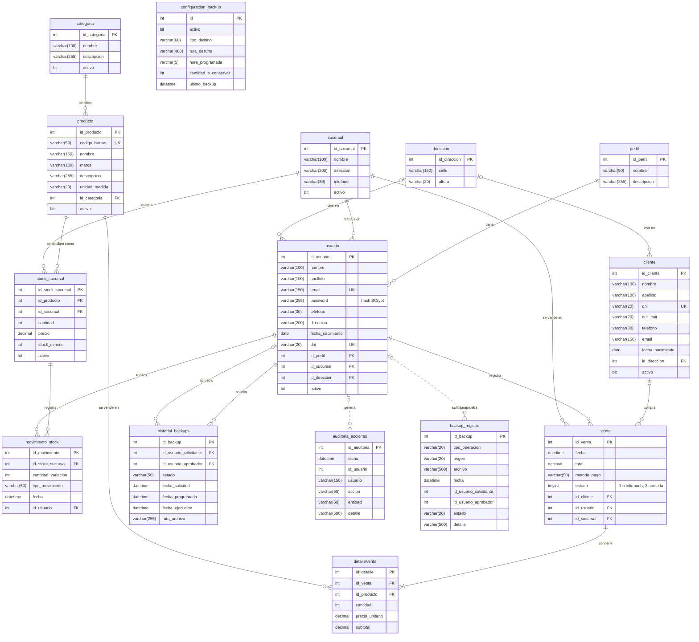

# DER – AorusMarket (SuperMercadoDB)

```mermaid
erDiagram
    %% ===== Relaciones con clave foranea (FK) =====
    perfil          ||--o{ usuario            : "tiene"
    sucursal        ||--o{ usuario            : "trabaja en"
    direccion       |o--o{ usuario            : "vive en"
    direccion       |o--o{ cliente            : "vive en"
    categoria       ||--o{ producto           : "clasifica"
    producto        ||--o{ stock_sucursal     : "se stockea como"
    sucursal        ||--o{ stock_sucursal     : "guarda"
    stock_sucursal  ||--o{ movimiento_stock   : "registra"
    usuario         ||--o{ movimiento_stock   : "realiza"
    cliente         |o--o{ venta              : "compra"
    usuario         ||--o{ venta              : "registra"
    sucursal        ||--o{ venta              : "se vende en"
    venta           ||--|{ detalleVenta       : "contiene"
    producto        ||--o{ detalleVenta       : "se vende en"
    usuario         ||--o{ historial_backups  : "solicita"
    usuario         |o--o{ historial_backups  : "aprueba"

    %% ===== Relaciones logicas (sin FK en la BD) =====
    usuario         |o..o{ auditoria_acciones : "genera"
    usuario         |o..o{ backup_registro    : "solicita/aprueba"

    perfil {
        int id_perfil PK
        varchar(50) nombre
        varchar(255) descripcion
    }

    sucursal {
        int id_sucursal PK
        varchar(100) nombre
        varchar(200) direccion
        varchar(30) telefono
        bit activo
    }

    direccion {
        int id_direccion PK
        varchar(150) calle
        varchar(20) altura
    }

    usuario {
        int id_usuario PK
        varchar(100) nombre
        varchar(100) apellido
        varchar(150) email UK
        varchar(255) password "hash BCrypt"
        varchar(30) telefono
        varchar(200) direccion
        date fecha_nacimiento
        varchar(20) dni UK
        int id_perfil FK
        int id_sucursal FK
        int id_direccion FK
        bit activo
    }

    cliente {
        int id_cliente PK
        varchar(100) nombre
        varchar(100) apellido
        varchar(20) dni UK
        varchar(20) cuil_cuit
        varchar(30) telefono
        varchar(150) email
        date fecha_nacimiento
        int id_direccion FK
        bit activo
    }

    categoria {
        int id_categoria PK
        varchar(100) nombre
        varchar(255) descripcion
        bit activo
    }

    producto {
        int id_producto PK
        varchar(50) codigo_barras UK
        varchar(150) nombre
        varchar(100) marca
        varchar(255) descripcion
        varchar(20) unidad_medida
        int id_categoria FK
        bit activo
    }

    stock_sucursal {
        int id_stock_sucursal PK
        int id_producto FK
        int id_sucursal FK
        int cantidad
        decimal precio
        int stock_minimo
        bit activo
    }

    movimiento_stock {
        int id_movimiento PK
        int id_stock_sucursal FK
        int cantidad_variacion
        varchar(50) tipo_movimiento
        datetime fecha
        int id_usuario FK
    }

    venta {
        int id_venta PK
        datetime fecha
        decimal total
        varchar(50) metodo_pago
        tinyint estado "1 confirmada, 2 anulada"
        int id_cliente FK
        int id_usuario FK
        int id_sucursal FK
    }

    detalleVenta {
        int id_detalle PK
        int id_venta FK
        int id_producto FK
        int cantidad
        decimal precio_unitario
        decimal subtotal
    }

    auditoria_acciones {
        int id_auditoria PK
        datetime fecha
        int id_usuario
        varchar(150) usuario
        varchar(60) accion
        varchar(60) entidad
        varchar(500) detalle
    }

    backup_registro {
        int id_backup PK
        varchar(20) tipo_operacion
        varchar(20) origen
        varchar(500) archivo
        datetime fecha
        int id_usuario_solicitante
        int id_usuario_aprobador
        varchar(20) estado
        varchar(500) detalle
    }

    configuracion_backup {
        int id PK
        bit activo
        varchar(60) tipo_destino
        varchar(400) ruta_destino
        varchar(5) hora_programada
        int cantidad_a_conservar
        datetime ultimo_backup
    }

    historial_backups {
        int id_backup PK
        int id_usuario_solicitante FK
        int id_usuario_aprobador FK
        varchar(50) estado
        datetime fecha_solicitud
        datetime fecha_programada
        datetime fecha_ejecucion
        varchar(255) ruta_archivo
    }
```
